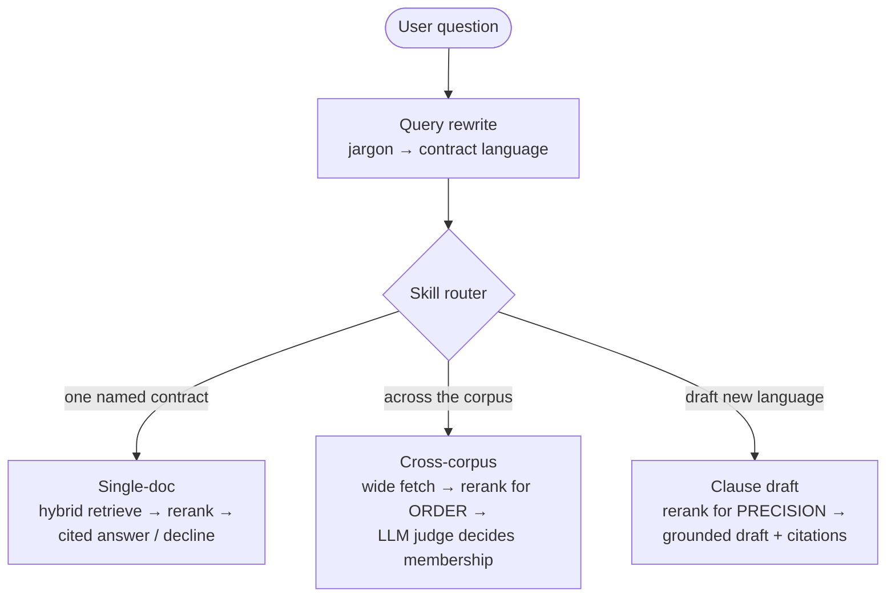

# Deal Desk Helper

[](https://github.com/stephenjang-creator/rag-revops/actions/workflows/ci.yml)
[](LICENSE)
[](https://www.python.org/)
[](https://github.com/astral-sh/ruff)
[](https://mypy-lang.org/)

**A citation-grounded contract-analysis tool that answers the two questions a Deal Desk actually gets asked — *"what does this contract say about X?"* and *"which contracts across our whole book have clause X?"* — and bridges the gap between how a business user phrases a question and how contracts are actually written.**

> **AI-first, human-in-the-loop.** Every answer is grounded in retrieved passages and cites its source. When the documents don't support an answer, the system says so instead of inventing one. Built in Python.

**[▶ Try the live demo](https://rag-revops.onrender.com)** &nbsp;·&nbsp; [What it does](#what-it-does) &nbsp;·&nbsp; [Architecture](#architecture) &nbsp;·&nbsp; [How the hard parts got solved](#the-engineering-story-how-the-hard-parts-got-solved)

---

## See it work — one box, ask anything


There's no mode to pick. You type a request in plain English and the system works out what you actually want. Here it takes the shorthand *"which contracts have TFCs"*:

1. **A router** reads the question and sends it to the **Find contracts with clauses** skill — a cross-corpus search over the whole book — and shows *why*, not just a label.
2. **Query rewriting** expands the shorthand into precise contract language (*"contracts with provisions for termination at the convenience of either party"*) and surfaces the interpretation, so you can trust what was searched.
3. **An LLM judge reads every contract for meaning, not keywords** — returning *9 of 100* that qualify, each with the exact passage and why it matched. It catches agreements that never say "termination for convenience" (e.g. *"terminate … for any or for no reason,"* *"15 days' written notice"*) — the ones a keyword or even a reranker search misses.

The three skills (draft language · find contracts with a clause · ask about one contract) are also selectable directly — the router just picks for you by default.

> *Bring-your-own-key: the hosted demo bakes in no API keys — paste your own Anthropic + Cohere keys into the key panel (browser-session only, never logged, never committed) and the question box goes live. Reviewers without keys still see the full UI, the recorded runs, the corpus, and the retrieval/citation behavior.*

---

## What this demonstrates

A small system, built the way I'd build a real one — the things a reviewer usually has to take on faith are all here in the repo:

- **Quality is gated, not asserted** — a GitHub Actions **faithfulness gate** runs an LLM-as-judge eval on every PR and fails the build if grounding drops below threshold.
- **Observable end-to-end** — per-request tracing (Langfuse) plus an SRE-style metrics sink (p50/p95 latency, citation coverage, failure/decline rate) that a second CI gate reads.
- **Typed and linted** — `mypy` + `ruff` in CI; prompts live in **versioned config**, not scattered string literals, so a prompt change is a reviewable diff.
- **Provenance as a first-class concern** — zero proprietary data; the corpus and eval set are built from public **CUAD** (CC BY 4.0), and the licensing is documented, not hand-waved.
- **Honest failure modes** — the system declines rather than guessing, and declines are excluded from faithfulness (grading a non-answer is meaningless).
- **Cost-conscious** — the per-query rewrite step runs on a free-tier model, keeping it off the main model's bill.

Tested throughout — retrieval, fusion, the LLM-judge logic, and the router each have unit tests.

- **Quality is gated, not asserted** — a GitHub Actions **faithfulness gate** runs an LLM-as-judge eval on every PR and fails the build if grounding drops below threshold.
- **Observable end-to-end** — per-request tracing (Langfuse) plus an SRE-style metrics sink (p50/p95 latency, citation coverage, failure/decline rate) that a second CI gate reads.
- **Typed and linted** — `mypy` + `ruff` in CI; prompts live in **versioned config**, not scattered string literals, so a prompt change is a reviewable diff.
- **Provenance as a first-class concern** — zero proprietary data; the corpus and eval set are built from public **CUAD** (CC BY 4.0), and the licensing is documented, not hand-waved.
- **Honest failure modes** — the system declines rather than guessing, and declines are excluded from faithfulness (grading a non-answer is meaningless).
- **Cost-conscious** — the per-query rewrite step runs on a free-tier model, keeping it off the main model's bill.

---

## What it does

**Ask anything (auto) — the default.** Type a question in plain English and a small **LLM router** classifies it and dispatches to the right skill below: answer about one named contract, find which contracts across the book have a clause, or draft new clause language. It shows which skill it chose and why, resolves a named contract to the right document, and — consistent with the rest of the design — declines to guess when the intent is genuinely ambiguous (e.g. "termination for convenience in the Acme MSA" is single-contract; "which contracts allow termination for convenience" is cross-corpus). You can always switch to a specific mode.

**The three skills over the same corpus:**

**1. Draft clause language** — "give me language for a termination-for-convenience clause" (or an NDA, a limitation of liability, an indemnity). The **cross-encoder reranker** pulls the most on-point real passages from the corpus, then Claude **drafts suggested language for a new contract**, grounded in those passages and citing the source contracts with inline `[n]` markers. The headline output is reusable drafting language — traceable to real agreements, not invented — with a **one-click, citation-free copy** to paste straight into an order form. It declines rather than fabricating a clause the corpus can't support. This is the exact opposite of skill 2: where skill 2 must *suppress* the reranker (it scores paraphrased clauses near zero), this skill is precision retrieval — the reranker's calibrated score is the signal that gates which passages are strong enough to draft from.

**2. Find contracts with clauses** — "which contracts allow termination for convenience?" scans every contract and returns the matching set, each with a one-line reason and citation. This is the harder capability, and the interesting one: it recognizes clauses that mean the same thing but are worded completely differently.

**3. Ask about a contract** — pick one contract (searchable list) and ask in plain English. The answer draws only from that contract, cites the passages it used with inline `[n]` markers, and declines when the contract doesn't cover the question.

**Query rewriting** sits in front of all three. A Deal Desk user types "can either party do a TFC" and the system reformulates it to "Can either party terminate this agreement for convenience, and what notice is required?" before retrieving — expanding abbreviations and jargon into contract language, and showing the interpretation so the user can see and trust what was searched. It runs on Cohere's free-tier `command` model by default (reusing the Cohere key already used for embeddings + rerank — no extra key, and it keeps this per-query step off the Anthropic bill), falling back to Anthropic when no Cohere key is present. Configurable via `rewrite.provider` in `config/settings.yaml`.

---

## The problem that makes this non-trivial

The hard part of "which contracts have X" is that **contracts rarely use the query's words.** A search for *termination for convenience* has to match:

- "Either party may terminate this Agreement **without cause** upon thirty days' notice"
- "...terminate **in its sole discretion**..."
- "...terminate **for any reason**..."
- "...terminate **without penalty**..."

A keyword search misses all of these. A vector/embedding search scores them low — they don't resemble the phrase *termination for convenience*. Even a cross-encoder reranker (the standard precision tool) scores these paraphrased clauses near **zero**, because it judges surface similarity, not legal meaning.

The fix is to use an **LLM as the membership judge** for cross-corpus queries: Claude reads each contract's excerpts and decides — with explicit legal-equivalence knowledge — whether it genuinely satisfies the criterion, recognizing that "terminate without cause" *is* termination for convenience. The reranker still orders which contracts the judge sees; it no longer gates membership. This recovered matches that pure retrieval scored at zero (16 vs. 4 on the termination query in one corpus).

---

## Architecture



The two retrieval skills are mirror images of each other, and that contrast is the core idea:

- **Cross-corpus** must *suppress* the reranker's score (it scores paraphrased clauses ~0) and let an **LLM judge** decide membership by legal meaning.
- **Clause drafting** is precision retrieval where the reranker's calibrated score *is* the signal — it surfaces the passages that most literally express the clause, which become grounding for the draft.

**Tech stack** (Python throughout):

| Layer | Choice | Why |
|---|---|---|
| Orchestration | **LangGraph** | Explicit state graph — the decline branch is a first-class conditional edge, not buried logic |
| Retrieval | **Hybrid: BM25 + vector, RRF fusion** | BM25 catches exact terms (section refs, figures); vectors catch paraphrase; RRF fuses on rank, not incompatible scores |
| Vector store | **ChromaDB** | Local, persistent, metadata filtering (enables single-contract scoping) |
| Embeddings + rerank | **Cohere** (`embed-v3`, `rerank-v3`) | Strong reranker; one vendor for both |
| Generation + judge | **Anthropic (Claude)** | Strong instruction-following for grounding; legal-equivalence reasoning the reranker lacks |
| Query rewrite | **Cohere `command`** (free tier) | A tiny per-query call; kept off the main model's bill |
| Evaluation | **Custom LLM-as-judge + set-based P/R/F1** | Transparent, no heavy framework dependency |
| UI | **Streamlit** | Python-native, bring-your-own-key hosted demo |

Prompts live in a **versioned config file** (`config/settings.yaml`), not scattered string literals — changing a prompt is a reviewable diff.

---

## The engineering story (how the hard parts got solved)

The cross-corpus capability didn't work on the first build. Getting it right meant diagnosing three distinct failures **with data**, not guesswork — each ruled out with a targeted experiment before any fix:

**1. A silent result cap.** The reranker returned only its top-5 results regardless of how many contracts were passed in — so 95 of 100 contracts were dropped before scoring, and the eval's default-fill made them look like zero-relevance. Diagnosed by instrumenting the reranked-result count; fixed by threading a `top_n` override so analytical mode scores every contract while single-doc mode keeps its cap.

**2. A semantic gap.** With the cap fixed, the reranker still scored paraphrased clauses ("without cause," "sole discretion") at ~0.00 — indistinguishable from irrelevant text. A controlled test (feeding the reranker known clause text) proved the cross-encoder was working correctly; it simply has no legal knowledge that "without cause" means "for convenience." Fixed by moving membership from the reranker's score to an **LLM judge** that reasons about equivalence.

**3. Polysemy, correctly handled.** Testing "Net 30 payment terms" surfaced a subtle win: a grep for "30 days" returns 70 contracts, but most are cure periods, notice windows, or reporting deadlines — not payment terms. The LLM judge correctly *disambiguates*, confirming only the contracts where "30 days" governs payment. A keyword search can't do this; the judge can.

The takeaway that generalized: **the query-rewriting front-end and the LLM-judge back-end give jargon-tolerance at both ends** — the question going in and the clause matching coming out.

---

## Evaluation

Quality is measured, not asserted.

- **Golden set from CUAD annotations.** The [Contract Understanding Atticus Dataset](https://www.atticusprojectai.org/cuad) (510 real contracts, expert clause annotations, CC BY 4.0) provides ground truth: which contracts have which clause. The golden set is built directly from those annotations.
- **Single-doc faithfulness** — a custom LLM-as-judge evaluator decomposes each answer into claims and checks each against the retrieved context (declines excluded, since faithfulness on a non-answer is meaningless).
- **Cross-corpus precision/recall/F1** — set comparison against the CUAD ground-truth sets. Deterministic (no judge calls), so it's cheap enough to gate CI.
- **CI faithfulness gate** — GitHub Actions runs the eval on every pull request and fails the build if faithfulness drops below threshold, so a well-meaning change to chunking or a prompt can't silently degrade quality.

---

## Observability & monitoring

Instrumented end-to-end, so a request isn't a black box — you can see what was retrieved, how it was reordered, the exact prompt and response, and what it cost. Tracing is **env-gated and off by default** (the deployed BYO-key demo runs untraced); the operational metrics that gate CI need no hosted service.

**Per-request tracing (Langfuse).** Every stage is a timed span: query rewrite → retrieval (which chunks, with scores) → rerank (the reordering, and the `top_n` result-cap as a standing metric) → citation-enforced generation, plus the LLM-judge membership decisions in analytical mode. The model calls carry token counts, so cost rolls up automatically.

**Operational metrics (SRE view).** Every request writes one line to a local sink; a reporter computes the signals averages hide. On a representative batch:

| Metric | Value | Note |
|---|---|---|
| Latency **p50 / p95** | **21s / 60s** | the gap is the two modes — single-doc vs. analytical judge fan-out; the 27s *mean* hides it |
| Citation coverage | **100%** | of answered requests (declines/errors excluded from the denominator) |
| Failure rate | **0%** | errors are recorded and re-raised, never swallowed |
| Decline rate | **17%** | the system refuses to answer when the corpus can't ground it — correct behavior, not a miss |
| LLM calls / request | **1 → 11** | single-doc ≈ 1; analytical fans out to query-rewrite + guidance + judge batches |

Latency here is dominated by trial-tier API rate-limit pacing, not compute — a production key removes most of the tail.

```bash
python -m rag_revops.metrics_report              # p50/p95, coverage, failure/decline rate
python -m rag_revops.metrics_report --since-min 60 --json
```

**Regression gating.** CI runs two gates on every pull request: the faithfulness gate above, and an operational gate that reads the metrics the eval run itself produced (no extra API spend). The build fails if **citation coverage drops below 80%**, **p95 latency exceeds 90s**, or the **failure rate exceeds 5%** — so a change that quietly degrades grounding or blows up latency can't merge. Prompts live in versioned config (`config/settings.yaml`) and the config version is stamped on every trace and metric, so a prompt edit is attributable to any metric shift it causes. Full detail in [`OBSERVABILITY.md`](OBSERVABILITY.md).

---

## Data provenance (zero proprietary data)

Every document is **public**. Nothing from any employer is used. The corpus and evaluation set are built from **CUAD** (CC BY 4.0). Handling licensing and provenance as a first-class concern — rather than quietly ingesting whatever's available — is itself part of the deliverable: a contract-analysis tool that can't say where its knowledge came from is a governance liability. See [`docs/DATA_PROVENANCE.md`](docs/DATA_PROVENANCE.md).

---

## Run it locally

```bash
python -m venv .venv && source .venv/bin/activate    # Windows: .\.venv\Scripts\Activate.ps1
pip install -e ".[dev]"
cp .env.example .env          # add ANTHROPIC_API_KEY + COHERE_API_KEY

# Build the corpus + index from the CUAD file
python scripts/extract_cuad.py --input path/to/CUADv1.json --contracts-out data/raw/contracts --eval-out eval/eval_seed.jsonl --max-contracts 100
python -m rag_revops.ingest --source data/raw/contracts

# CLI
python -m rag_revops.query "How is liability capped?"
python -m rag_revops.query_analytical "Which contracts allow termination for convenience?"

# Or the full UI (all modes)
streamlit run app.py
```

## Evaluation & tests

```bash
pytest                                          # unit tests (retrieval, fusion, judge, router logic)
python -m eval.build_golden --seed eval/eval_seed.jsonl --out eval/golden.jsonl
python -m eval.run_eval --golden eval/golden.jsonl --limit 15          # faithfulness
python -m eval.build_analytical_golden --seed eval/eval_seed.jsonl --out eval/analytical_golden.jsonl
python -m eval.run_analytical_eval --golden eval/analytical_golden.jsonl --limit 3   # set-based P/R/F1
```

## Repo layout

```
src/rag_revops/
  loaders.py chunking.py embeddings.py vectorstore.py       # ingestion + storage
  bm25.py hybrid.py rerank.py retrieval.py                  # retrieval
  query_rewrite.py router.py                                # jargon → contract language; skill routing
  graph.py generation.py query.py                           # single-doc pipeline (LangGraph)
  analytical.py analytical_generation.py query_analytical.py  # cross-corpus + LLM judge
  clause_finder.py clause_drafting.py                       # reranker-driven clause drafting
  observability.py metrics_report.py                        # tracing + SRE metrics
eval/
  build_golden.py run_eval.py judge.py                      # faithfulness eval
  build_analytical_golden.py run_analytical_eval.py         # set-based eval
config/settings.yaml                                        # versioned prompts + tunables
app.py                                                       # Streamlit UI (all modes)
.github/workflows/ci.yml                                    # tests + faithfulness/ops gates
```

## License

Code: [MIT](LICENSE). Data: CUAD is CC BY 4.0 — see [`docs/DATA_PROVENANCE.md`](docs/DATA_PROVENANCE.md).
